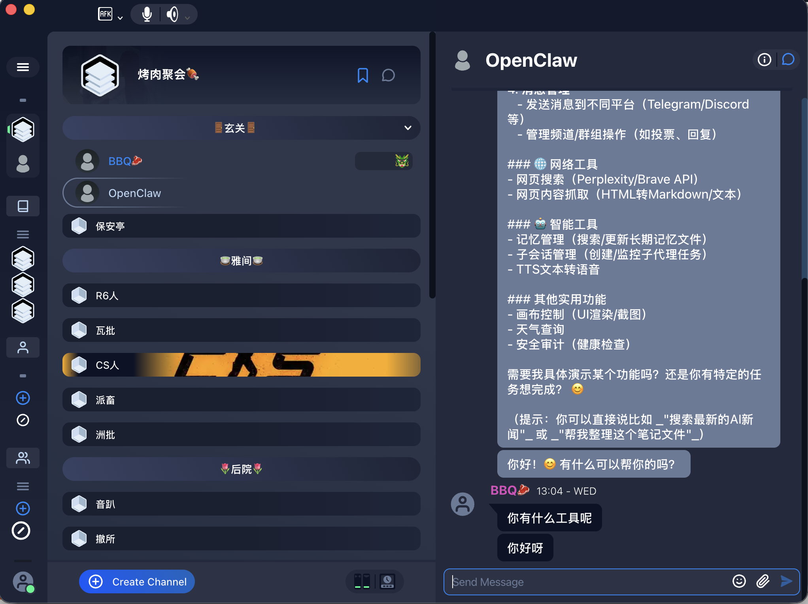
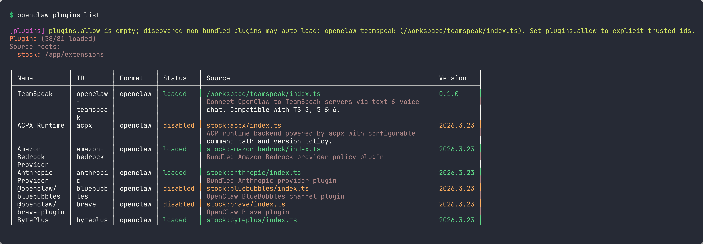

<div align="center">

# @honeybbq/openclaw-teamspeak

**OpenClaw channel plugin for TeamSpeak — text & voice chat via the native client protocol.**

**Compatible with TeamSpeak 3, 5 & 6.**

[](https://github.com/HoneyBBQ/openclaw-teamspeak/actions/workflows/ci.yml)
[](https://www.npmjs.com/package/@honeybbq/openclaw-teamspeak)
[](LICENSE)

</div>

## Gallery

|                   TeamSpeak Client                   |                   OpenClaw Plugin                    |
| :--------------------------------------------------: | :--------------------------------------------------: |
|  |  |

## Features

- **Text chat** — Bidirectional text messages between OpenClaw and TeamSpeak
- **Voice (TTS)** — Bot speaks replies into the TS3 channel via Opus
- **Voice (STT)** — Transcribe incoming TS3 voice and process as text messages
- **DM & channel modes** — Configurable access policies (pairing, allowlist, open)
- **Mention detection** — Regex-based mention patterns for channel messages
- **Per-channel overrides** — Fine-grained control per TS3 channel
- **Auto identity** — Generates and persists TS3 identities automatically

## Installation

```bash
openclaw plugins install @honeybbq/openclaw-teamspeak
```

## Configuration

Add to your OpenClaw config:

```json
{
  "teamspeak": {
    "server": "ts.example.com",
    "nickname": "OpenClaw Bot",
    "dmPolicy": "pairing",
    "tts": { "enabled": true, "replyMode": "both" },
    "stt": { "enabled": true }
  }
}
```

See [`openclaw.plugin.json`](openclaw.plugin.json) for the full config schema.

## Roadmap

- **ServerQuery integration** — Connect via TS3 ServerQuery to give OpenClaw full server administration capabilities: manage channels, kick/ban users, assign server groups, and view server stats — all through natural language
- **Multi-server support** — Connect to multiple TeamSpeak servers simultaneously from a single OpenClaw instance
- **Permission-aware tools** — Expose TS3 permissions as OpenClaw tools so the agent can reason about who can do what before acting
- **Channel auto-provisioning** — Let OpenClaw create and manage temporary channels on demand (e.g. for meetings, events)
- **File sharing bridge** — Bidirectional file transfers between OpenClaw conversations and TS3 file browser
- **Presence & status sync** — Reflect OpenClaw agent availability as TS3 client status (away, idle, active)
- **Whisper lists** — Target voice messages to specific users or groups without switching channels
- **Event webhooks** — Forward TS3 server events (user joins, channel edits, complaints) to OpenClaw for automated responses

## Related

- **[@honeybbq/teamspeak-client](https://github.com/HoneyBBQ/teamspeak-js)** — The underlying TeamSpeak 3 client protocol library

## Disclaimer

TeamSpeak is a registered trademark of [TeamSpeak Systems GmbH](https://teamspeak.com/). This project is not affiliated with, endorsed by, or associated with TeamSpeak Systems GmbH in any way.

## License

[MIT](LICENSE)
